# HACKATHON_NW2026 - Relay Logistics Backend

Monolithic backend for the NextWave 2026 demo focused on terrestrial logistics coordination via voice agents.

> **Core Principle:** The AI converses, proposes, and listens; but the deterministic backend services validate, decide, persist, and change the official state of the operation.

🔗 **Frontend Repository:** [https://github.com/luismdg/Relay](https://github.com/luismdg/Relay)

## 📊 Architecture and System Flow

Below is the complete diagram of the logical architecture, roles, and the flow of voice processes:

```mermaid
flowchart LR
    subgraph Entrada["1 · People and channels"]
        direction TB
        Operador["Operator<br/>creates and queries operations"]
        Transportista["Carrier<br/>quotes and confirms"]
        Conductor["Driver<br/>reports progress and incidents"]
        Apoyo["Support person<br/>handles a transfer"]
        Twilio["Twilio<br/>calls, audio and SMS"]

        Operador <-->|"Call"| Twilio
        Transportista <-->|"Call and SMS"| Twilio
        Conductor <-->|"Call"| Twilio
        Apoyo <-->|"Conference, only if requested"| Twilio
    end

    subgraph VozYContexto["2 · Voice, context and memory"]
        direction TB
        Identificar["Identify call and purpose<br/>person + operation + call"]
        Sesion["Independent conversation<br/>listens, responds and allows interruptions"]
        Contexto["Prepare reliable context<br/>objective + data + limits + history"]
        ElegirAgente{"What does this call need?"}
        AgenteOperacion["Operations Agent<br/>creates or queries"]
        AgenteNegociacion["Negotiation Agent<br/>quotes and confirms"]
        AgenteSeguimiento["Tracking Agent<br/>updates or escalates"]

        Identificar --> Sesion --> Contexto --> ElegirAgente
        ElegirAgente -->|"Create or query"| AgenteOperacion
        ElegirAgente -->|"Quote or confirm"| AgenteNegociacion
        ElegirAgente -->|"Tracking or incident"| AgenteSeguimiento
    end

    Twilio <-->|"Real-time audio"| Identificar

    subgraph Control["3 · Rules, protection and shared memory"]
        direction TB
        Acciones["Allowed actions<br/>based on person and stage"]
        Validar["Validate before saving<br/>identity + mandate + evidence + state"]
        Aclarar["Ask for clarification<br/>without inventing or modifying data"]
        Guardar["Save official result"]
        Memoria[("Persistent memory<br/>operations · calls · transcripts<br/>quotes · agreements · incidents")]
        Aislamiento["Per-call protection<br/>without mixing audio, context or results"]

        Acciones --> Validar
        Validar -->|"Missing information"| Aclarar
        Validar -->|"Valid action"| Guardar --> Memoria
        Aislamiento --> Validar
        Memoria -->|"Context for the next call"| Acciones
    end

    AgenteOperacion --> Acciones
    AgenteNegociacion --> Acciones
    AgenteSeguimiento --> Acciones
    Memoria -.->|"Retrieves the operation when calling again"| Contexto
    Aclarar -.-> Sesion

    subgraph Proceso["4 · Complete transport process"]
        direction LR
        Crear["Create operation<br/>container, route, date, weight and delivery"]
        Mandato["Define mandate<br/>max price, currency and conditions"]
        Campana["Contact carriers<br/>up to 3 simultaneous calls"]
        Cotizar["Negotiate<br/>availability, price and date"]
        Precio{"Were price and currency<br/>said by the carrier?"}
        Evaluar["Validate and save quote<br/>with transcript as evidence"]
        Elegir["Compare valid options<br/>and choose the best"]
        Confirmar["Call back the winner<br/>and confirm conditions"]
        Acuerdo["Save agreement<br/>and send summary via SMS"]
        Recoleccion["Confirm pickup"]
        Transito["Track<br/>the transit"]
        Incidencia{"Is there an incident or<br/>change outside the mandate?"}
        Entrega["Confirm delivery<br/>and close operation"]

        Crear --> Mandato --> Campana --> Cotizar --> Precio
        Precio -->|"No"| Cotizar
        Precio -->|"Yes"| Evaluar --> Elegir --> Confirmar --> Acuerdo
        Acuerdo --> Recoleccion --> Transito --> Incidencia
        Incidencia -->|"No"| Entrega
        Incidencia -->|"Yes, but authorized"| Transito
    end

    AgenteOperacion --> Crear
    AgenteNegociacion --> Campana
    AgenteSeguimiento --> Transito
    Evaluar --> Guardar
    Acuerdo --> Guardar
    Entrega --> Guardar

    subgraph Continuidad["5 · Exceptions without stopping the process"]
        direction TB
        NoContesta{"Did the carrier answer?"}
        Regreso["Log NO ANSWER<br/>can return the call and resume"]
        Transferencia{"Did this call ask<br/>to speak with a person?"}
        MarcarApoyo["Call the support person first"]
        Unir["If they answer, join only<br/>that call in conference"]
        SeguirIA["If they don't answer, the call<br/>continues safely with RELAY"]

        NoContesta -->|"No"| Regreso
        NoContesta -->|"Yes"| Transferencia
        Transferencia -->|"No"| SeguirIA
        Transferencia -->|"Yes"| MarcarApoyo
        MarcarApoyo -->|"Answers"| Unir
        MarcarApoyo -->|"Doesn't answer"| SeguirIA
    end

    Campana --> NoContesta
    Regreso -.-> Identificar
    Incidencia -->|"Outside mandate"| Transferencia
    Unir --> Apoyo
    SeguirIA -.-> Sesion

    Principios["Security principles<br/>• one session per call<br/>• the agent converses; the backend decides<br/>• only the carrier's voice proves a price<br/>• a simple 'yes' doesn't create a quote<br/>• a transfer affects only whoever requested it<br/>• the history allows continuing after hanging up"]
    Validar -.-> Principios

    classDef persona fill:#FFF4D6,stroke:#B7791F,color:#3D2A00;
    classDef canal fill:#E3F2FD,stroke:#1976D2,color:#0D3B66;
    classDef agente fill:#E8EAF6,stroke:#5C6BC0,color:#20255A;
    classDef regla fill:#E8F5E9,stroke:#388E3C,color:#173A1A;
    classDef decision fill:#FFF3E0,stroke:#F57C00,color:#5D2D00;
    classDef dato fill:#F3E5F5,stroke:#8E24AA,color:#41104F;
    classDef humano fill:#FCE4EC,stroke:#C2185B,color:#5A1230;

    class Operador,Transportista,Conductor persona;
    class Apoyo humano;
    class Twilio canal;
    class Sesion,AgenteOperacion,AgenteNegociacion,AgenteSeguimiento agente;
    class Validar,Aislamiento,Guardar,Principios regla;
    class ElegirAgente,Precio,Incidencia,NoContesta,Transferencia decision;
    class Memoria dato;
```



## 🛠 Tech Stack

The project uses a modern and lightweight set of tools focused on development speed and ease of demonstration:

- **Language:** TypeScript (run with `tsx`).
- **Web Framework:** Express.js (handling REST endpoints, Swagger, and Webhooks).
- **Database:** SQLite (`better-sqlite3`). Allows avoiding containers and heavy dependencies.
- **ORM:** Drizzle ORM (strong typing, migrations in code).
- **Voice and Telephony:** Twilio (PSTN, Media Streams for bidirectional audio, Webhooks).
- **Artificial Intelligence:** OpenAI Realtime API (WebSocket) for conversation handling and tool usage (function calling).
- **API Documentation:** Swagger / OpenAPI 3.1.

## 📁 Module Distribution (Vertical Architecture)

The code is structured into domain-oriented modules (simplified Domain-Driven Design) within `src/modules/`, improving cohesion:

- `operations/`: Creation and tracking of the logistics operation (origin, destination, container).
- `mandates/`: Management of the immutable "authority" (max price, date).
- `carriers/`: Directory of carriers and their evaluation/score.
- `campaigns/`: Orchestration to source carriers and initiate simultaneous calls.
- `negotiations/`: Tracking of the individual state with each carrier during a campaign.
- `market/`: Logic to compare multiple valid `quotes` and choose a winner (`LOWEST_VALID_TOTAL`, `BEST_WEIGHT_PRICE_RATIO`).
- `commitments/`: Consolidation of the winning agreement (verbal confirmation and SMS recap).
- `calls/`: Traceability of every inbound/outbound call and its transcript/brief.
- `realtime/`: Critical bridge (Gateway) connecting Twilio Media Streams with the OpenAI Realtime API via WebSockets. Manages the "Agent Handoff" (Operations, Logistics) by limiting available tools.
- `telephony/`: Abstraction over the Twilio API (Outbound calls, conference/escalation, SMS).
- `incidents/` & `escalations/`: Exception management and handoff to human operators.
- `audit/`: Immutable timeline (append-only) of events.

## ⚙️ Environment Variables and Configuration

A `.env` file is required in the root directory (use `.env.example` as a reference).

| Variable | Description |
|----------|-------------|
| `PORT` | Local port (e.g., 3000) |
| `VOICE_RUNTIME_MODE` | `local` (mocks, no real calls) or `twilio` (requires full credentials). |
| `OPENAI_API_KEY` | Key to connect to the OpenAI Realtime API. |
| `TWILIO_ACCOUNT_SID` | Twilio account SID. |
| `TWILIO_AUTH_TOKEN` | Twilio security token. |
| `TWILIO_PHONE_NUMBER` | Number from which calls are made and received. |
| `PUBLIC_HTTP_URL` | E.g., `https://my-domain.ngrok-free.app` (for Twilio REST webhooks). |
| `PUBLIC_WS_URL` | E.g., `wss://my-domain.ngrok-free.app` (for Twilio Media Streams). |
| `ESCALATION_HUMAN_PHONE` | Real cell phone number to transfer calls to when a mandate deviation occurs. |

## 🚀 Deployment and Local Setup

### Quick Local Start (Mock/Local Mode)
Ideal for developing without spending Twilio balance or relying on web tunnels:

```powershell
npm install
npm run db:generate  # (If you modified Drizzle schemas)
npm run db:push      # Pushes changes to local SQLite
npm start            # Or npm run dev for watch
```
- API and Swagger: `http://127.0.0.1:3000/docs`

### Deployment with Real Voice (Twilio/Ngrok)
To interact via voice, Twilio needs to contact your local server. 

1. Spin up a tunnel (e.g., Ngrok or Pinggy) to port 3000:
   ```bash
   ngrok http 3000
   ```
2. Update your `.env` with the tunnel URLs:
   ```
   VOICE_RUNTIME_MODE=twilio
   PUBLIC_HTTP_URL=https://<id>.ngrok.app
   PUBLIC_WS_URL=wss://<id>.ngrok.app
   ```
3. Run `npm run dev`.
4. Configure the Webhook of your Twilio number (Inbound Call) to: `https://<id>.ngrok.app/api/v1/webhooks/twilio/voice`.

## ❓ Frequently Asked Questions (Q&A)

**Q: Why use SQLite for a "logistics" project?**  
A: It's a Hackathon MVP focused on voice agents and AI, not on massive distributed processing. SQLite eliminates friction, the need for containers, and makes it easy to reset the database (by deleting a file) during presentations.

**Q: How do we prevent the AI from accepting prices above the mandate?**  
A: The golden rule is: *"The AI proposes, the backend decides"*. When the agent tries to save a quote, it uses a tool (`POST .../evaluate`). If the value exceeds what is stipulated in the database, the backend returns a formal rejection to the tool, which the AI interprets to counteroffer or say goodbye; **it can never bypass the deterministic validation**.

**Q: How is the loss of concurrency handled when the server restarts?**  
A: There is a conscious trade-off where outbound call "Jobs" reside in an in-memory queue. If the server (Node.js) shuts down abruptly, the in-memory queue is lost. However, the operational data persists in SQLite.

**Q: Do you save the call audios for auditing?**  
A: No. To optimize, we only save the **Text transcript and offsets (milliseconds)** within the record of a *Commitment* or a *Call Brief*. Twilio can record externally if configured, but the app does not download/handle audio blobs directly.

**Q: What model does OpenAI handle?**  
A: To support full-duplex audio and realistic conversational latency, we integrate directly via WebSockets against the **OpenAI Realtime API** (Voice models of the `gpt-4o-realtime` family). LangGraph is not in the audio middleman to avoid introducing noticeable delays, although tools can be used to call asynchronous LangChain chains.
