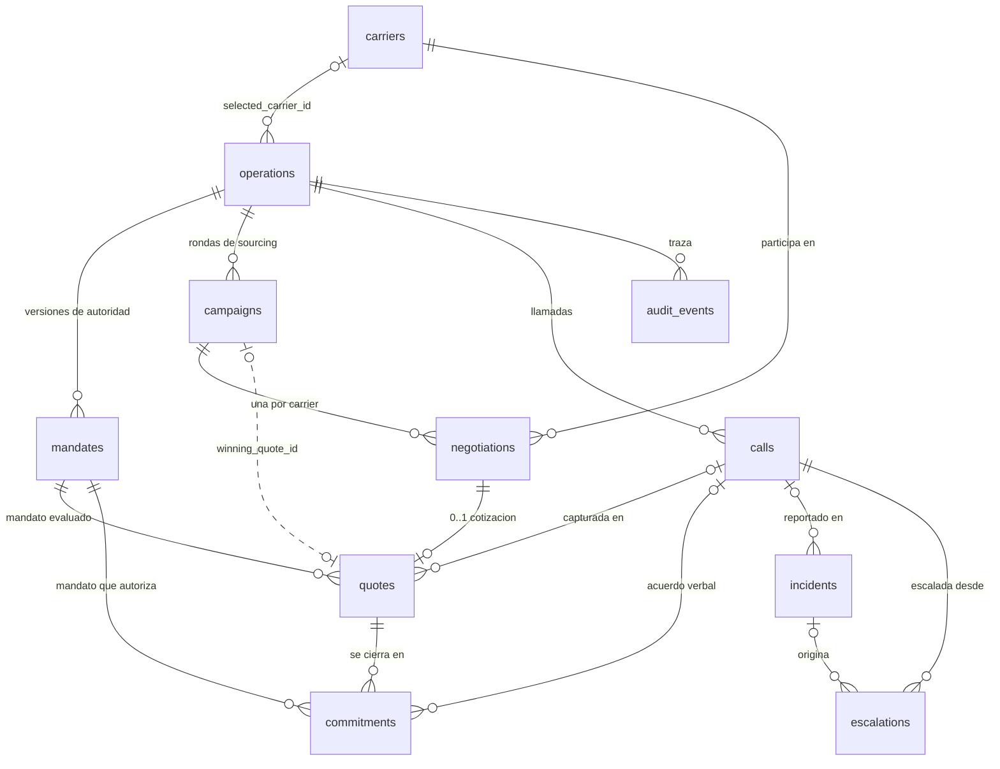
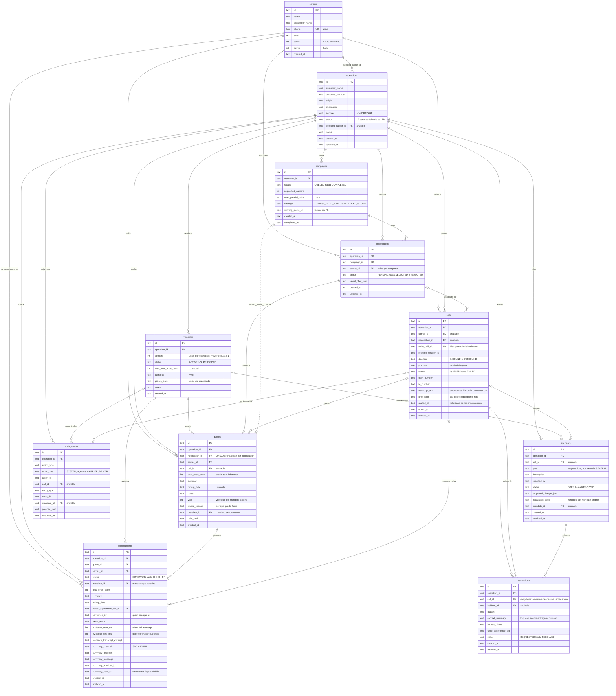

# Diagrama entidad-relación — SQLite de la demo

Referencia visual del esquema definido en [`02-base-de-datos-sqlite.md`](./02-base-de-datos-sqlite.md).
Los diagramas están en Mermaid: GitHub los renderiza en línea, viajan con el repo y se
versionan como texto plano.

Convenciones de las líneas:

| Símbolo | Significado |
|---|---|
| `\|\|` | exactamente uno |
| `\|o` | cero o uno (columna anulable) |
| `o{` | cero o muchos |
| línea continua | FK declarada en el DDL |
| línea punteada | vínculo lógico **sin** `REFERENCES` (ver §3.4) |

---

## 1. Mapa de dominio — la columna vertebral

Este es el diagrama para las slides y el README: sigue el flujo del negocio
(operación → mandato → campaña → negociación → cotización → compromiso) sin ahogarse en
columnas.

Toda entidad operacional dependiente lleva `operation_id ... ON DELETE CASCADE`: la operación
es la raíz del agregado y borrarla se lleva su historia completa. `carriers` es un catálogo
independiente y no pertenece a una sola operación.



Cómo leerlo en voz alta ante los jueces:

> Una operación tiene **muchas versiones de mandato** pero solo una activa. Lanza campañas de
> sourcing; cada campaña abre una negociación por carrier; cada negociación produce **como
> máximo una cotización**; solo una cotización se convierte en compromiso, y solo puede haber
> **un compromiso activo por operación**. Todo lo que pasó por teléfono cuelga de `calls`, y
> todo lo que ocurrió queda en `audit_events`.

---

## 2. Esquema completo



---

## 3. Lo que el diagrama NO puede dibujar

Un ER muestra tablas y FKs. Las garantías que de verdad defienden el sistema ante los jueces
son **índices parciales y CHECKs**, y no aparecen como líneas. Hay que nombrarlas aparte.

### 3.1 Un solo mandato activo por operación

```sql
CREATE UNIQUE INDEX uq_mandates_one_active_per_operation
  ON mandates(operation_id) WHERE status = 'ACTIVE';
```

Los mandatos se **versionan, no se sobrescriben**. Este índice parcial hace imposible que
existan dos autoridades vigentes a la vez. `quotes.mandate_id` y
`commitments.mandate_id` apuntan directamente a la fila inmutable que existía en cada decisión.
El número `version` permanece únicamente en `mandates` y se obtiene con un `JOIN`.

### 3.2 Un solo compromiso activo por operación — el anti-doble-booking

```sql
CREATE UNIQUE INDEX uq_commitments_one_active_per_operation
  ON commitments(operation_id)
  WHERE status IN ('PROPOSED', 'VERBALLY_AGREED', 'MANDATE_VALIDATED',
                   'SUMMARY_PENDING', 'SUMMARY_SENT', 'VALID', 'IN_EXECUTION');
```

Es el índice más importante del esquema. Tres llamadas concurrentes pueden llegar a acuerdo al
mismo tiempo; **la base de datos, no el LLM, garantiza que solo una cierre.** Es
`COMMIT_AUTHORIZED` implementado como restricción física. Los estados cancelados quedan fuera
del filtro, así que tras un `CANCELLED_BY_CARRIER` la operación puede volver a comprometerse.

### 3.3 El precio de la quote siempre es el total

Para mantener la demo simple, `quotes` conserva solamente `total_price_cents`. El agente debe
pedir al carrier un precio total antes de llamar la tool; el Mandate Engine compara ese valor
contra `mandates.max_total_price_cents`. No se desglosan tarifa base, cargos ni condiciones.

### 3.4 Vínculo lógico sin FK declarada

| Columna | Apunta a | Por qué no hay `REFERENCES` |
|---|---|---|
| `campaigns.winning_quote_id` | `quotes.id` | Dependencia circular: la campaña nace antes que las cotizaciones. |

Va punteado en el diagrama. Al no ser FK, un `winning_quote_id` que
apunte a una quote inexistente no lo detiene nadie.

---

## 4. Cómo verlo

- **En GitHub**: se renderiza solo al abrir este archivo. Cero herramientas.
- **En VS Code**: extensión *Markdown Preview Mermaid Support*, luego `Ctrl+Shift+V`.
- **Para exportar a la presentación**: pegar el bloque en <https://mermaid.live> y descargar
  SVG (vectorial, no se pixela en el proyector).
- **Contra la base real**, una vez que exista `data/nextwave-demo.sqlite`: *DB Browser for
  SQLite* o *DBeaver* generan el ER desde el archivo — sirve para verificar que el DDL
  aplicado coincide con este diagrama.
